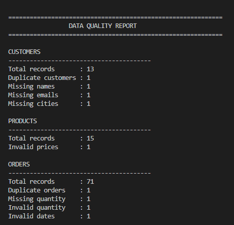
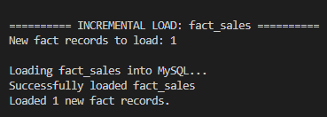
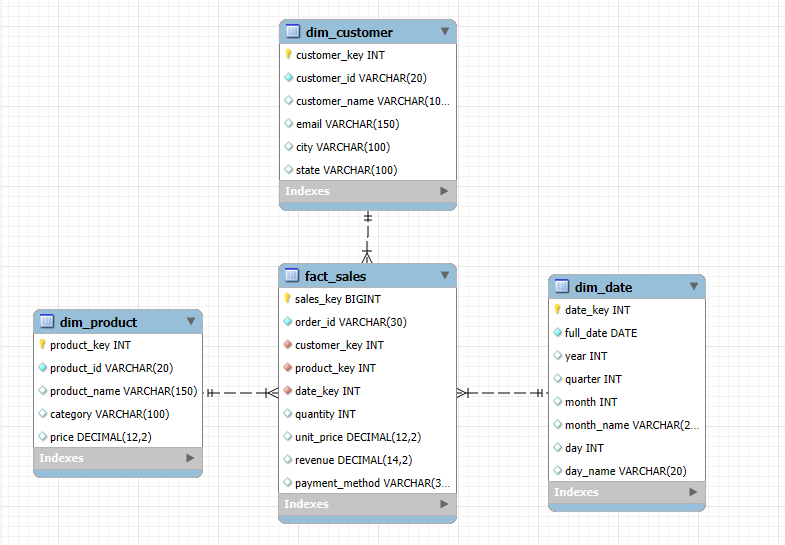
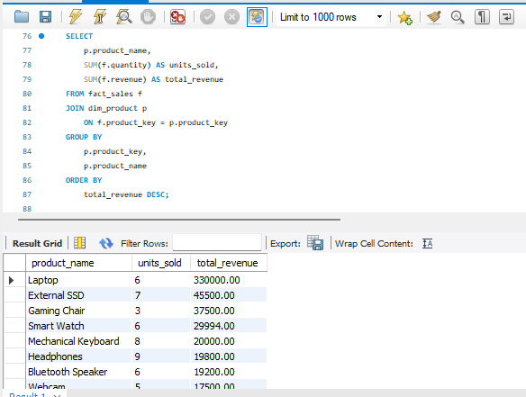

<div align="center">

# 📊 Sales Data ETL & Analytics Pipeline

### End-to-End Data Engineering Project

**Python • PySpark • SQL • MySQL • Data Warehousing**

<p>
  
  
  
  
</p>

</div>

---

## 📌 Overview

**Sales Data ETL & Analytics Pipeline** is an end-to-end data engineering project that takes raw sales data from **CSV and JSON sources**, processes it using **PySpark**, performs data-quality checks and transformations, and loads the cleaned data into a **MySQL star-schema data warehouse**.

The warehouse is then used for analytical SQL queries covering sales performance, products, customers, categories, payments, geography, and time-based trends.

A key feature of the project is **incremental fact loading** using `order_id`, which prevents previously loaded sales records from being inserted again when the ETL pipeline is rerun.

---

## 🎯 Project Goals

- Build a complete ETL pipeline using PySpark
- Process both CSV and JSON data sources
- Detect and clean intentionally dirty data
- Transform raw sales data into an analytical model
- Design a MySQL star-schema data warehouse
- Use surrogate keys for dimension tables
- Load fact and dimension data using JDBC
- Implement incremental and idempotent fact loading
- Perform business-oriented SQL analytics

---

# 🏗️ Architecture

```text
                  ┌──────────────────────┐
                  │      RAW DATA        │
                  │                      │
                  │ customers.csv        │
                  │ orders.csv           │
                  │ products.json        │
                  └──────────┬───────────┘
                             │
                             ▼
                  ┌──────────────────────┐
                  │       PySpark        │
                  │         ETL          │
                  └──────────┬───────────┘
                             │
              ┌──────────────┼──────────────┐
              ▼              ▼              ▼
       Data Quality       Cleaning     Validation
              │              │              │
              └──────────────┼──────────────┘
                             ▼
                    Transformations
                    Joins & Revenue
                         Calculation
                             │
                             ▼
                  ┌──────────────────────┐
                  │    STAR SCHEMA       │
                  │                      │
                  │ dim_customer         │
                  │ dim_product          │
                  │ dim_date             │
                  │ fact_sales           │
                  └──────────┬───────────┘
                             │
                             ▼
                  ┌──────────────────────┐
                  │       MySQL          │
                  │  Data Warehouse      │
                  └──────────┬───────────┘
                             │
                             ▼
                  ┌──────────────────────┐
                  │    SQL Analytics     │
                  └──────────────────────┘
```

---

# 🛠️ Technology Stack

| Technology | Role |
|---|---|
| **Python** | ETL application and pipeline orchestration |
| **PySpark** | Data ingestion, cleaning, transformation and aggregation |
| **SQL** | Analytics and warehouse validation |
| **MySQL** | Data warehouse |
| **MySQL Workbench** | Database management and SQL execution |
| **JDBC** | PySpark → MySQL connectivity |
| **python-dotenv** | Secure environment configuration |
| **Git / GitHub** | Version control and project hosting |

> **Power BI is optional** and can be added later as a visualization layer.

---

# 📂 Project Structure

```text
Sales_ETL_Analytics/
│
├── data/
│   ├── raw/
│   │   ├── customers.csv
│   │   ├── orders.csv
│   │   └── products.json
│   │
│   └── processed/
│
├── src/
│   ├── main.py
│   └── warehouse/
│       ├── __init__.py
│       └── mysql_loader.py
│
├── sql/
│   └── analytics.sql
│
├── notebooks/
├── screenshots/
│   ├── data_quality_report.png
│   ├── incremental_load.png
│   ├── mysql_star_schema.png
│   └── sql_analytic.png
│
├── .env
├── .gitignore
├── requirements.txt
└── README.md
```

---

# 🔄 ETL Pipeline

## 1. Extract

The pipeline reads structured and semi-structured sales data:

- `customers.csv`
- `orders.csv`
- `products.json`

PySpark is used for ingestion and DataFrame processing.

## 2. Inspect

Before transformation, the pipeline displays:

- Data schemas
- Record counts
- Sample records

## 3. Data Quality

The pipeline identifies:

- Duplicate customers
- Duplicate orders
- Missing customer attributes
- Missing quantities
- Invalid quantities
- Invalid product prices
- Invalid dates
- Invalid customer IDs
- Invalid product IDs

## 4. Clean

The pipeline:

- Trims whitespace
- Removes duplicates
- Handles missing customer attributes
- Removes invalid product prices
- Removes invalid quantities
- Safely parses dates
- Standardizes payment methods
- Removes invalid customer/product references

## 5. Transform

Orders are joined with customer and product information.

Revenue is calculated as:

```text
Revenue = Quantity × Unit Price
```

The transformed dataset contains the information required for the warehouse fact table.

## 6. Load

Clean data is loaded into MySQL using Spark JDBC.

## 7. Analyze

SQL queries are executed against the warehouse to generate analytical insights.

---

# 🧹 Data Quality & Cleaning

The raw dataset intentionally contains dirty records so the pipeline demonstrates real ETL data-quality handling.

### Customer Data

| Issue | Handling |
|---|---|
| Duplicate customer | Removed |
| Missing name | Replaced with `Unknown` |
| Missing email | Replaced with `unknown@example.com` |
| Missing city/state | Replaced with `Unknown` |
| Extra whitespace | Trimmed |

### Product Data

| Issue | Handling |
|---|---|
| Invalid/non-positive price | Removed |
| Duplicate product | Removed |
| Extra whitespace | Trimmed |

### Order Data

| Issue | Handling |
|---|---|
| Duplicate order | Removed |
| Missing quantity | Excluded during cleaning |
| Non-positive quantity | Removed |
| Invalid date | Removed |
| Invalid customer ID | Removed |
| Invalid product ID | Removed |
| Inconsistent payment method | Standardized |

---

# ⭐ Data Warehouse Design

The project uses a **Star Schema** consisting of one central fact table and three dimension tables.

```text
                         ┌─────────────────┐
                         │  dim_customer   │
                         └────────┬────────┘
                                  │
                                  │
┌─────────────────┐        ┌──────▼───────┐        ┌─────────────────┐
│   dim_product   │───────►│  fact_sales  │◄───────│     dim_date    │
└─────────────────┘        └──────────────┘        └─────────────────┘
```

## Fact Table

### `fact_sales`

Stores measurable sales transactions.

| Column | Description |
|---|---|
| `sales_key` | Auto-increment surrogate primary key |
| `order_id` | Business order ID |
| `customer_key` | Foreign key to customer dimension |
| `product_key` | Foreign key to product dimension |
| `date_key` | Foreign key to date dimension |
| `quantity` | Units sold |
| `unit_price` | Selling price per unit |
| `revenue` | Calculated sales revenue |
| `payment_method` | Payment method |

## Dimension Tables

### `dim_customer`

```text
customer_key
customer_id
customer_name
email
city
state
```

### `dim_product`

```text
product_key
product_id
product_name
category
price
```

### `dim_date`

```text
date_key
full_date
year
quarter
month
month_name
day
day_name
```

---

# 🔑 Surrogate Keys

The warehouse uses surrogate keys in dimension tables.

Example:

```text
Business ID       Surrogate Key
-----------       --------------
C001                    1
C002                    2
C003                    3
```

The fact table stores these surrogate keys rather than repeating descriptive dimension information.

This separates **business identifiers** from **warehouse identifiers** and supports a conventional dimensional-modeling approach.

---

# ⚡ Incremental Loading

The fact table uses `order_id` as the business key for incremental loading.

Before inserting incoming sales, the pipeline reads existing order IDs from `fact_sales`.

A **left-anti join** is then used to identify records that are not already present.

```text
                 Incoming Orders
                       │
                       ▼
             Read existing order_id
                from MySQL
                       │
                       ▼
                 Compare IDs
                  ┌────┴────┐
                  │         │
              Existing     New
                  │         │
                  ▼         ▼
                 Skip     Insert
```

### Why incremental loading?

Without incremental loading:

```text
Run 1 → 64 records
Run 2 → 128 records  ❌
Run 3 → 192 records  ❌
```

With incremental loading:

```text
Run 1 → 64 records
Run 2 → 64 records   ✅
Run 3 → 64 records   ✅
```

If one new valid order arrives:

```text
Existing records = 64
New records      = 1
Final records    = 65
```

This makes repeated ETL execution safe for the order-level fact load.

---

# 📊 SQL Analytics

The project contains analytical SQL covering:

### 💰 Sales KPIs

- Total customers
- Total products
- Total sales records
- Total orders
- Total revenue
- Average order value

### 📦 Product Analytics

- Units sold by product
- Revenue by product
- Product ranking
- Top 3 products per category

### 🗂️ Category Analytics

- Revenue by category
- Units sold by category

### 👥 Customer Analytics

- Customer revenue
- Customer order count
- Customer ranking
- Customer value

### 📅 Time Analytics

- Daily revenue
- Monthly revenue
- Running revenue
- Month-over-month revenue

### 💳 Payment Analytics

- Revenue by payment method
- Order distribution by payment method

### 🌎 Geographic Analytics

- Revenue by state
- Revenue by city

### 🔍 Warehouse Validation

- Dimension record counts
- Fact record counts
- Foreign-key validation

---

# 📈 Current Dataset

The current development dataset intentionally contains dirty records.

### Raw Data

| Dataset | Records |
|---|---:|
| Customers | **13** |
| Products | **15** |
| Orders | **71** |

### After Cleaning

| Dataset | Records |
|---|---:|
| Clean Customers | **12** |
| Clean Products | **14** |
| Clean Orders | **64** |
| Sales Records | **64** |

---

# 🖼️ Project Screenshots

## 1. Data Quality Report

Shows the quality checks performed on the raw customer, product and order datasets.



---

## 2. Incremental Loading

Shows the incremental-loading stage used to prevent duplicate fact records.



---

## 3. MySQL Star Schema

Shows the warehouse structure and relationships between the fact and dimension tables.



---

## 4. SQL Analytics

Shows analytical SQL execution and warehouse results in MySQL Workbench.



---

# 🚀 Getting Started

## Prerequisites

Install:

- Python
- Java compatible with your PySpark installation
- Apache Spark / PySpark
- MySQL Server
- MySQL Workbench

### Windows Hadoop Support

The current project is configured for Windows Hadoop support using:

```text
C:/hadoop
```

The required Hadoop configuration is handled in `src/main.py`.

---

## 1. Clone the Repository

```bash
git clone <your-github-repository-url>
cd Sales_ETL_Analytics
```

## 2. Create a Virtual Environment

```bash
python -m venv venv
```

Windows:

```bash
venv\Scripts\activate
```

## 3. Install Dependencies

```bash
pip install -r requirements.txt
```

## 4. Configure Environment Variables

Create a `.env` file in the project root:

```env
MYSQL_HOST=localhost
MYSQL_PORT=3306
MYSQL_DATABASE=sales_dw
MYSQL_USER=root
MYSQL_PASSWORD=YOUR_PASSWORD
```

> ⚠️ Never commit `.env` or database credentials to GitHub.

## 5. Create the Database

Open MySQL Workbench:

```sql
CREATE DATABASE sales_dw;
USE sales_dw;
```

Create the warehouse tables:

```text
dim_customer
dim_product
dim_date
fact_sales
```

using the project's database schema.

## 6. Run the ETL Pipeline

From the project root:

```bash
python src/main.py
```

The pipeline performs:

```text
Extract
  ↓
Inspect
  ↓
Data Quality
  ↓
Clean
  ↓
Transform
  ↓
Create Dimensions
  ↓
Create Fact Dataset
  ↓
Incremental Load
  ↓
MySQL Warehouse
```

## 7. Run SQL Analytics

Open:

```text
sql/analytics.sql
```

in MySQL Workbench.

Run the queries against:

```sql
USE sales_dw;
```

---

# 🎤 Interview Discussion

## 60-Second Project Explanation

> I built an end-to-end Sales Data ETL and Analytics Pipeline using Python, PySpark, SQL and MySQL. The pipeline ingests sales data from CSV and JSON sources, performs data-quality checks and cleaning using PySpark, transforms the data and loads it into a MySQL star-schema data warehouse. The warehouse contains customer, product, date and sales fact tables connected through surrogate keys. I also implemented incremental loading using order IDs so rerunning the pipeline does not insert previously processed sales. Finally, I created SQL analytics for revenue, products, customers, categories, payment methods and time-based trends.

## Why PySpark?

> PySpark provides DataFrame-based processing and APIs for cleaning, joining, transforming and aggregating data. It also provides a path to scale the ETL workload beyond a local Python-only implementation.

## Why a Star Schema?

> A star schema separates measurable business events from descriptive dimensions. This makes analytical queries simpler and is a common modeling approach for data warehouses.

## How are duplicate fact records prevented?

> Existing `order_id` values are read from the MySQL fact table. The incoming data is compared against those IDs using a left-anti join, so only previously unseen orders are inserted.

## Why MySQL?

> MySQL provides a relational environment for implementing the dimensional model, enforcing foreign-key relationships and running analytical SQL queries.

---

# 🔮 Future Improvements

The current project can be extended with:

- [ ] Apache Airflow orchestration
- [ ] Dockerization
- [ ] Cloud object storage
- [ ] Cloud data warehouse
- [ ] Automated data-quality tests
- [ ] Structured logging and monitoring
- [ ] Slowly Changing Dimensions (SCD)
- [ ] Complete calendar date dimension
- [ ] Power BI dashboard
- [ ] CI/CD pipeline
- [ ] Unit and integration testing

---

# 👨‍💻 Author

**Rajat Goyal**

Computer Engineering Student

**Core Technologies**

`Python` · `PySpark` · `SQL` · `MySQL` · `ETL` · `Data Warehousing`

---

<div align="center">

### ⭐ Built as a practical Data Engineering portfolio project

</div>
